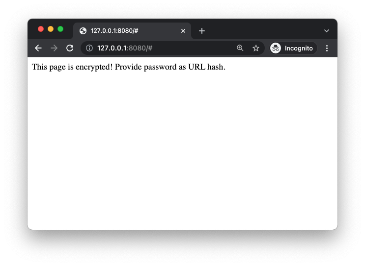
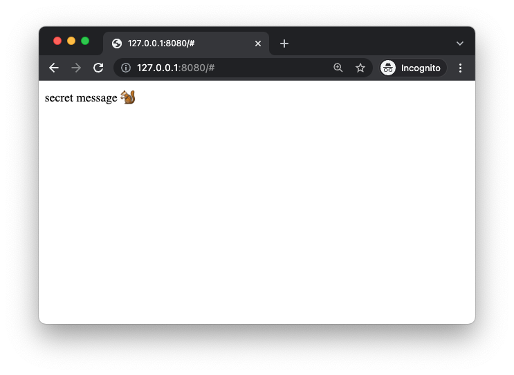

# hscrypt demos
Examples using [`hscrypt`] and [`hscrypt-webpack-plugin`] to encrypt and deploy static sites.

`hscrypt` simulates "anyone with the link can view" permissioning for publicly-hosted static web apps (e.g. on GitHub Pages). Please read [the Disclaimer section](#disclaimer) before using.

## Hello World
Here's a simple example (taken from [00-simple](./00-simple):

```html
<!-- index.html -->
<html>
<body>
This page is encrypted! Please provide password as URL hash.
</body>
</html>
```

```javascript
// secret.js
document.body.innerHTML = 'secret message 🐿'  // inject secret message (or an entire application!) somewhere on page
```

```javascript
// webpack.config.js
const path = require("path")
const HTMLWebpackPlugin = require("html-webpack-plugin");
const HscryptPlugin = require("hscrypt-webpack-plugin").default;

module.exports = {
    entry: "./src/secret.js",
    output: { path: path.resolve(__dirname, 'dist'), filename: "bundle.js" },
    plugins: [
        new HTMLWebpackPlugin({ inject: true, template: 'index.html' }),
        new HscryptPlugin({ path: "dist", filename: "bundle.js", pswd: "my-password" })
    ]
}
```

```bash
# bash
npm install webpack
node_modules/.bin/webpack  # build encrypted bundle
http-server dist           # serve dist/ folder
```

### Encrypted landing page
Then open http://127.0.0.1:8080 (or whichever port `http-server` prints):



This is `index.html` from above.

### Decrypting via URL-hash password
If you know the password (set at build time in `webpack.config.js` above), you can decrypt the page by adding the password as a URL "hash": [http://127.0.0.1:8080#my-password]:



### Decryption failure
Incorrect password fails to decrypt, triggers an alert:


## Disclaimer <a id="disclaimer"></a>
- There is cryptography here and I am not a cryptographer!
- **Passwords should have ≥60 bits of entropy**; see ["Key Derivation"](#key-derivation).
- I tried to use various crypto primitives correctly, but you should audit before trusting.
- I am not aware of any bugs, but to my knowledge no one else has looked at it. I make no representations that it is secure or does what it's supposed to.
- My intention is to use `hscrypt` to host private data on GitHub Pages "soon", and I will update this note when I do, but I am not currently relying on it "in production."
  - I also intend to publish a honeypot encrypted site and offer a bounty ($20) to anyone that can break it (and explain it to me so that I can fix it 😄). I will also update this when that's live.    

## Crypto(graphy) <a id="cryptography"></a>
Here's an overview of the cryptographic operations performed by hscrypt; please [tell me][hscrypt/js/issues/new] if you spot any errors or think I'm thinking about something incorrectly.

#### ChaCha20 <a id="chacha20"></a>
I found and used ChaChas20 after earlier experiments with PGP-encrypted pages (around [gitlab.com/smondet/hscrypt]), where my impression was that PGP-decryption at page load time was painfully slow.  I searched for a faster symmetric cipher, and ChaCha20 seemed to be the best choice.

I ported [thesimj/js-chacha20] to typescript: [hscrypt/ts-chacha20]. I am trusting `js-chacha20`, and have not audited it.

### Encryption <a id="encryption"></a>
The encryption path is at [hscrypt/js/src/encrypt.ts]. Given:
- some Javascript source (e.g. the contents of a Webpack-compiled `bundle.js`; see [hscrypt/webpack-plugin]),
- a password
- a number of iterations for PBKDF2
  - optional, defaults to 20k, but **requires very strong passwords!**
  - see [⚠️ PBKDF2 iterations ⚠️][#pbkdf2-iterations] below for caveats/discussion)

`hscrypt.encrypt` will:
- generate a 32-byte salt and 12-byte nonce
- pass salt, iterations, and password to PBKDF2 to obtain the "encryption key" 
- initialize a ChaCha20 encoder with nonce and encryption key
- prepend a "magic string" (`/* hscrypt */ `) to the JS source, encrypt it with ChaCha20 to obtain "ciphertext"
- concatenate salt, nonce, and ciphertext, return this buffer

### Decryption
Decryption of an encrypted script bundle happens in [`hscrypt._decrypt`][hscrypt/js/src/hscrypt.ts], and basically just inverts the encryption path.

Given inputs:
- `encrypted` buffer returned by `hscrypt.encrypt`
- password
- iterations (for PBKDF2)
- optional `decryptionKeyHex`: when `cacheDecryptionKey` is enabled, the decryption path can receive this value and skip an expensive key-derivation computation

`hscrypt._decrypt` will:
- slice nonce and ciphertext from `encrypted` buffer
- if `decryptionKeyHex` was not provided:
  - slice salt from `encrypted` buffer
  - pass salt, iterations, and password to PBKDF2 to obtain the "decryption key" 
- initialize a ChaCha20 decoder with nonce and decryption key
- decrypt ciphertext using the ChaCha20 decoder to obtain "plaintext"
- verify that plaintext begins with the "magic string" `/* hscrypt */ `, remove it to obtain original Javascript source
- return source as well as decryption key (the latter allowing for callers to cache it, to implement `cacheDecryptionKey`)

### Injection
"Injection" of an encrypted script bundle into the page happens in [`hscrypt.inject`][hscrypt/js/src/hscrypt.ts] which wraps the decryption path flow:
- check for password or decryption key in 3 places (short-circuiting on first find):
  - `pswd` argument to `hscrypt.inject`
  - URL hash (e.g. [http://127.0.0.1:8080#my-password] above; if a hash is found, it's immediately removed from the URL bar (⚠️ ️️but likely exists in your browser's history, as plaintext ⚠️)
  - localStorage cache of decryption key (post-PBDKF2, not password; saves time on reload, when `cacheDecryptionKey` is enabled)
- if no password or decryption key is found:
  - optionally register a `"hashchange"` listener
    - if the user subsequently enters a hash (manually), or navigates to a hash of the current URL, re-attempt the injection+decryption flow
  - fire a configurable callback (default: `console.log` a message explaining that no password was found)
  - return
- fetch the encrypted, remote source bundle (typically named e.g. `bundle.js.encrypted`)
- decrypt it
- if applicable, cache the decryption key (as a hex string) in `localStorage`
- if any errors arose, call a configurable callback
  - by default, check if a cached decryption key was used, and if so, purge it (as evidently the encrypted bundle has changed so that the cached decryption key no longer works)
  
### Key Derivation <a id="key-derivation"></a>
hscrypt uses PBKDF2 (provided by [CryptoJS][CryptoJS.PBKDF2]), with SHA512, and [**defaults to 20k iterations**][hscrypt/js/src/utils.ts].

⚠️ 20,000 iterations of SHA512 means **you should use passwords with ≥60 bits of entropy** (see ["Password strength"](#password-strength) below). ⚠️

⚠️ hscrypt-encrypted bundles are designed to be published on the internet where anyone can download them and point password crackers at them, 24/7, indefinitely into the future. ⚠️

**Your best defense will always be using a strong(er) password,** which also doesn't incur key-derivation time-cost during page load.

#### PBKDF2 iterations: 20k x SHA512 <a id="pbkdf2-iterations"></a>
There is a direct tradeoff between "page load time" and "page security" embodied in the `iterations` param (passed to PBKDF2):
- hscrypt's default configuration (20k x SHA512) loads a page in ≈1s on my 2021 Macbook Air.
- I'd like for pages to not be delayed longer than that when loading, so **it is imperative that you use a strong enough password** so that your page is as secure as you need it to be.

#### ⚠️ 20k may not be enough iterations! You should compensate with strong passwords (or more iterations) ⚠️
- [OWASP recommendation: **120k iterations of SHA512**][OWASP Password Cheat Sheet], or 310k iterations of SHA256
- 1password uses 100k iterations of SHA256, cf. ["1Password Security Design" whitepaper][1password-whitepaper], pg. 19:
  > Your account password and the salt are passed to PBKDF2-HMACSHA256 with 100,000 iterations

  As an aside: it's interesting that 1Password is 3x lower than the OWASP recommendation; I interpret them both as targeting a level of security that is beyond what the average hscrypt site requires.

Another way to think about it is: for a given level of security, each extra bit of entropy allows for halving the iterations (and therefore key-derivation time)! A very strong password (e.g. a 20-byte Git SHA from a private repository using [hscrypt/webpack-plugin]) in principle would allow reducing the iterations to 0, and still be as secure as a 145-entropy-bit password (160 - log₂(20,000)).

#### Password strength, $/hashrate <a id="password-strength"></a>
Here is some envelope-math about how much it *may* cost to crack passwords of various strengths, given PBKDF2 with 20,000 rounds of SHA512, and an attacker with a hashes-per-dollar ratio equal to that implied by the Bitcoin network:

|   Entropy bits | Cost to crack* |   Hex chars |   Base64 chars |   Diceware words |
|---------------:|---------------:|------------:|---------------:|-----------------:|
|             40 |          $0.01 |       10    |            6.7 |              3.1 |
|             45 |          $1.74 |       11.25 |            7.5 |              3.5 |
|             50 |           $257 |       12.5  |            8.3 |              3.9 |
|             55 |         $38250 |       13.75 |            9.2 |              4.3 |
|             60 |         $5.7MM |       15    |           10   |              4.6 |
|             65 |         $842MM |       16.25 |           10.8 |              5   |
|             70 |         $125BN |       17.5  |           11.7 |              5.4 |
|             75 |      $18,557BN |       18.75 |           12.5 |              5.8 |
|             80 |   $2,754,191BN |       20    |           13.3 |              6.2 |

\* Assumptions/Notes:
- Password hashed with PBKDF2, using 20,000 iterations of SHA512
- Hashes/$ implied by current [BTC hash rate][Bitcoin's network hashrate]:
  - Hash rate (≈2e20H/s) / block reward (6.25BTC/10mins x $40k/BTC ⟹ ≈$400/s) ⟹ ≈5e17 hashes/$
  - log₂([≈5e17 hashes/$] / [20,000 PBKDF2 iterations]) ≈ 44.5 bits of entropy ≈ $1

Conservative assumptions (I hope):
- $/SHA256 = $/SHA512: in reality, SHA512 is supposed to be "harder" than SHA256. I'm assuming it is at least as hard.
- Assumes attacker $/H equivalent to what BTC miners get with SHA256. Most real-world attackers of hscrypt bundles will presumably pay more per hash. 

Again, [I am not an expert](#disclaimer) and no one has vetted any part of this analysis or the hscrypt implementation!

## Credits
- Ben Newman ([**@benjamn**](https://github.com/benjamn)) (lots of JS/TS/WP/ESM/CJS help)
- Seb Mondet ([**@smondet**](https://github.com/smondet)) (wrote [gitlab.com/smondet/hscrypt], showed/explained it to me)
- Mykola Bubelich [**@thesimj**](https://github.com/thesimj) (author of [thesimj/js-chacha20])

### Other inspiration
[robinmoisson/staticrypt]: a very similar, apparently popular tool! [Demo][staticrypt demo]. I noticed it after I'd already done a fair amount of work on hscrypt, and thought I wanted some features or a different design that motivated continuing to write my own version of it anyway, e.g. password in URL hash, webpack integration, decryption-key caching (recently added in [staticrypt#124](https://github.com/robinmoisson/staticrypt/pull/124)!) and other deployment / configuration things I still haven't gotten around to implementing. It may be that I'd have an easier time adding features to staticrypt. I need to do more diligence.

[`hscrypt`]: https://github.com/hscrypt/js
[`hscrypt-webpack-plugin`]: https://github.com/hscrypt/webpack-plugin
[hscrypt/webpack-plugin]: https://github.com/hscrypt/webpack-plugin
[hscrypt/ts-chacha20]: https://github.com/hscrypt/ts-chacha20
[thesimj/js-chacha20]: https://github.com/thesimj/js-chacha20
[hscrypt/js/src/encrypt.ts]: https://github.com/hscrypt/js/blob/main/src/encrypt.ts
[hscrypt/js/src/hscrypt.ts]: https://github.com/hscrypt/js/blob/main/src/hscrypt.ts
[hscrypt/js/src/utils.ts]: https://github.com/hscrypt/js/blob/main/src/utils.ts
[http://127.0.0.1:8080#my-password]: http://127.0.0.1:8080#my-password
[gitlab.com/smondet/hscrypt]: https://gitlab.com/smondet/hscrypt
[OWASP Password Cheat Sheet]: https://cheatsheetseries.owasp.org/cheatsheets/Password_Storage_Cheat_Sheet.html

[#pbkdf2-iterations]: #pbkdf2-iterations

[1password-pbkdf2]: https://blog.1password.com/1password-hashcat-strong-master-passwords/
[cryptosense-pbkdf2]: https://cryptosense.com/blog/parameter-choice-for-pbkdf2
[janetpanic-pbkdf2]: https://janetpanic.com/which-is-better-bcrypt-or-pbkdf2/
[stackexchange-pbkdf2]: https://security.stackexchange.com/a/31846
[1password-whitepaper]: https://1passwordstatic.com/files/security/1password-white-paper.pdf
[1password-support]: https://support.1password.com/pbkdf2/

[CryptoJS.PBKDF2]: https://cryptojs.gitbook.io/docs/#pbkdf2

[Bitcoin's network hashrate]: https://www.blockchain.com/charts/hash-rate

[hscrypt/js/issues/new]: https://github.com/hscrypt/js/issues/new
[robinmoisson/staticrypt]: https://github.com/robinmoisson/staticrypt
[staticrypt demo]: https://robinmoisson.github.io/staticrypt/
